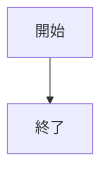
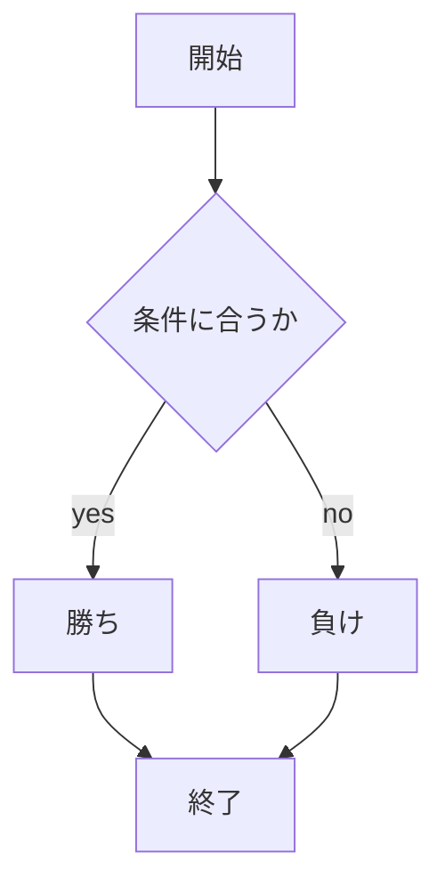

# webpro_06

## このプログラムについて
ファイル名　| 説明
-|-
app5.js | プログラム本体
public/unity.html|作成した各機能にアクセスするためのリンク一覧
public/script.js|リンクを掲載するためのファイル
views/dice.ejs|ダイスをn回振れる機能のテンプレートファイル
views/gacha.ejs|ガチャガチャのテンプレートファイル
views/gamble.ejs|丁半ゲームのテンプレートファイル
views/icon.ejs|Appleアイコンを表示するためのテンプレートファイル
views/luck.ejs|おみくじ機能のテンプレートファイル
views/show.ejs|挨拶を表示するためのテンプレートファイル
views/weather.ejs|天気予報機能のテンプレートファイル
public/jankedn.html  |　じゃんけんの開始画面
views/janken.ejs | じゃんけんのテンプレートファイル

## アクセス方法
public/unity.htmlを開くと各リンクへアクセスできます．
# hello1
### 説明
"Hello world"と"Bon jour"のメッセージをそれぞれmessage1とmessage2という変数に格納しています．
その後，res.renderを使って'show'テンプレートを表示し，オブジェクト 
{ greet1: message1, greet2: message2 } をテンプレートに渡しています．
変数を使っているので，将来的にメッセージが変更される可能性がある場合には便利です．
### 使用手順
ブラウザでhttp://localhost:8080/hello1 またはにアクセスします.

# hello2
### 説明
こちらでは，直接文字列をres.renderの引数として渡しています．
直接的な方法で，変数を宣言せずにテンプレートにメッセージを渡しています．
### 使用手順
ブラウザでhttp://localhost:8080/hello2 またはにアクセスします.

# icon
### 説明
res.renderでiconテンプレートを表示し，以下のオブジェクトを渡しています．
```
{ filename: "./public/Apple_logo_black.svg", alt: "Apple Logo" }
```
画像ファイルは/publicディレクトリに保存されており，静的ファイルとして提供されています．
### 使用手順
ブラウザでhttp://localhost:8080/iconにアクセスすると，Appleロゴ画像が表示されます．

1. app5.jsを起動する
1. Webブラウザでlocalhost:8080/public/janken.htmlにアクセスする
1. 自分の手を入力する




