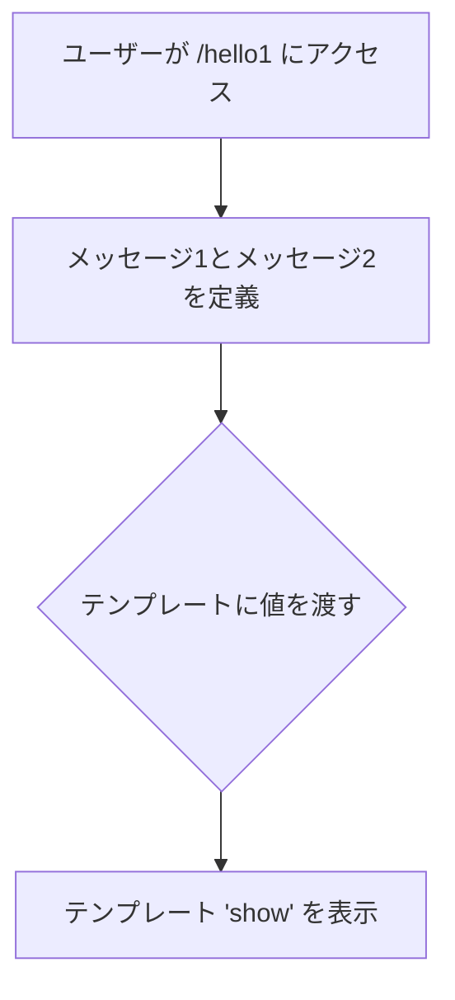
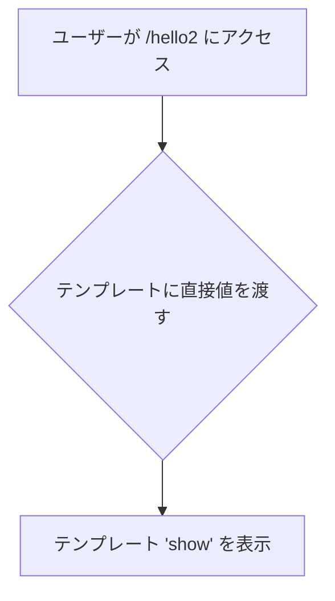
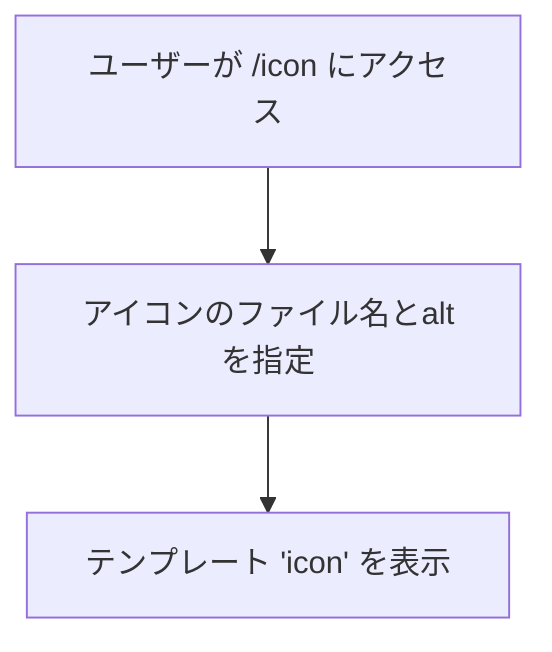
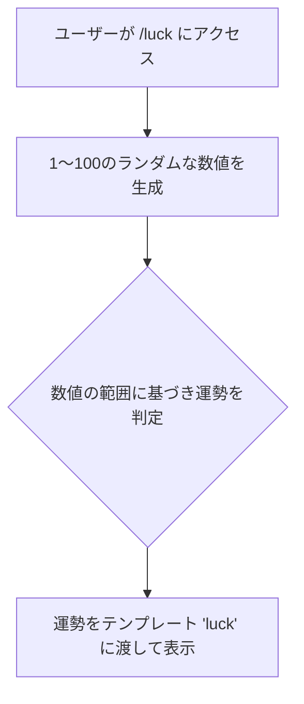
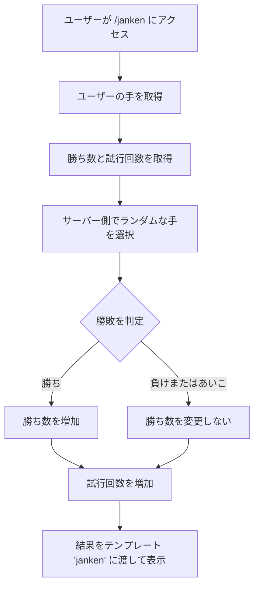
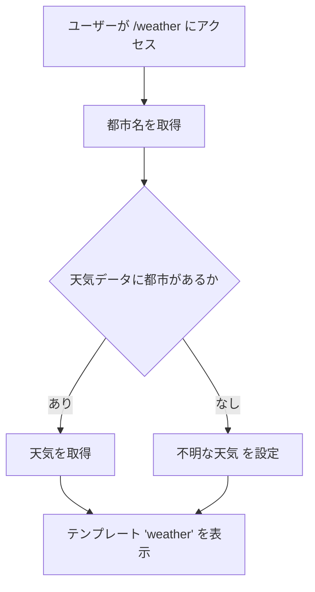
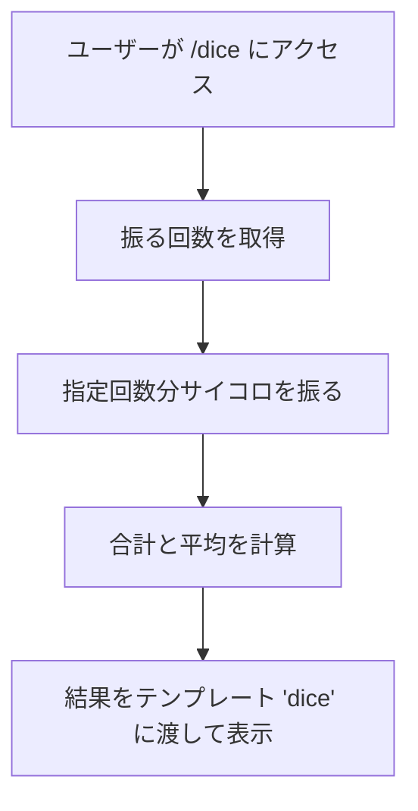
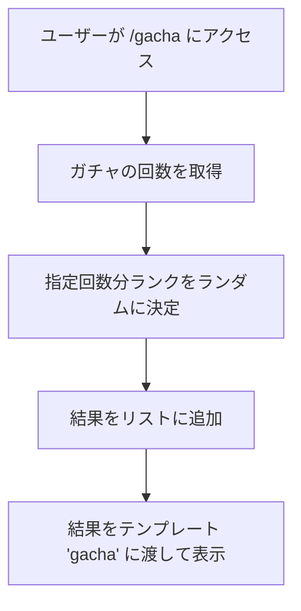

# webpro_06

## このプログラムについて
ファイル名　| 説明
-|-
app5.js | プログラム本体
public/unity.html|作成した各機能にアクセスするためのリンク一覧
public/script.js|リンクを掲載するためのファイル
views/dice.ejs|ダイスをn回振れる機能のテンプレートファイル
views/gacha.ejs|ガチャガチャのテンプレートファイル
views/gamble.ejs|丁半ゲームのテンプレートファイル
views/icon.ejs|Appleアイコンを表示するためのテンプレートファイル
views/luck.ejs|おみくじ機能のテンプレートファイル
views/show.ejs|挨拶を表示するためのテンプレートファイル
views/weather.ejs|天気予報機能のテンプレートファイル
public/jankedn.html  |　じゃんけんの開始画面
views/janken.ejs | じゃんけんのテンプレートファイル

## アクセス方法
1. ```app5.js```を起動する．
2. ```public/unity.html```を開くと各リンクへアクセスできます．

# hello1
### 説明
```"Hello world"```と```"Bon jour"```のメッセージをそれぞれ```message1```と```message2```という変数に格納しています．
その後，```res.render```を使って```'show'```テンプレートを表示し，オブジェクト 
```{ greet1: message1, greet2: message2 }``` をテンプレートに渡しています．
変数を使っているので，にメッセージが変更される際には便利です．
### 使用手順
ブラウザでhttp://localhost:8080/hello1 またはにアクセスします.



# hello2
### 説明
こちらでは，直接文字列を```res.render```の引数として渡しています．
直接的な方法で，変数を宣言せずにテンプレートにメッセージを渡しています．
### 使用手順
ブラウザでhttp://localhost:8080/hello2 またはにアクセスします.



# icon
### 説明
```res.render```で```icon```テンプレートを表示し，以下のオブジェクトを渡しています．
```
{ filename: "./public/Apple_logo_black.svg", alt: "Apple Logo" }
```
画像ファイルは/publicディレクトリに保存されており，静的ファイルとして提供されています．
### 使用手順
ブラウザでhttp://localhost:8080/icon にアクセスすると，Appleロゴ画像が表示されます．



#　luck
### 説明
このルートでは，ランダムな数値を生成し，運勢を占う簡単なおみくじ機能を提供します．

動作
1. 数値の生成

- ```Math.random()```を使用して、1から100までのランダムな整数を生成します.
生成された数値は```num```に格納されます.
2. 運勢の判定

- numの値に基づいて，以下の条件で運勢を判定します.
- 1～10: 大吉 
- 11～30: 吉 
- 31～50: 中吉 
- 51～70: 小吉 
- 71～90: 末吉 
- 91～100: 凶 
3. 結果の表示

- ```res.render```を使用して```luck```テンプレートを表示します.
以下のオブジェクトがテンプレートに渡されます:

```{ number: num, luck: luck }```
```number```: ランダムに生成された数値.
```luck```: 判定された運勢.



# janken
### 説明
じゃんけんゲーム．

動作
1. 入力
- ```hand```: ユーザーの手 (グー, チョキ, パー).
- ```win``` (省略可): 勝ち数．
- ```total``` (省略可): 試行回数．
2. サーバーの処理
- ランダムにサーバーの手を選びます．
- 勝敗を判定し，勝ち数と試行回数を更新します．
3. 出力
- ユーザーの手，サーバーの手，勝敗，勝ち数，合計試行回数を表示します．
### 使用手順
ブラウザでhttp://localhost:8080/janken にアクセスすると，じゃんけんがプレイ可能です．


# weather
### 説明
指定した都市の天気を表示します．
動作
1. 入力
- パラメータ```city```で都市名を指定します．

2. サーバーの処理
- あらかじめ定義された天気データから該当する都市の天気を取得します.
- 該当がない場合は"不明な天気"を返します.
3. 出力
- 指定した都市とその天気情報を表示します.
### 使用手順

ブラウザでhttp://localhost:8080/weather にアクセスすると，天気予報が可能です．



# dice
### 説明
サイコロを振り，結果の合計と平均を計算します．

動作
1. 入力
- クエリパラメータ```rolls```で振る回数を指定します (デフォルトは1).
- 10000000000回振ったらクラッシュしました．
2. サーバーの処理
- 指定回数分ランダムに1～6の数字を生成します．
- 合計と平均を計算します．
3. 出力
- 各サイコロの結果，合計，平均を表示します．
- 振る回数ごとの平均値は回数をを増やすほど3.5に収束していきます．
### 使用手順
ブラウザでhttp://localhost:8080/dice にアクセスすると，サイコロを振ることが可能です．



# gacha
### 説明
ガチャを引き，ランクを決定します．

動作
1. 入力
- クエリパラメータ```pulls```でガチャの回数を指定します (デフォルトは1).
2. サーバーの処理
- 各ガチャに対してランダムにランクを決定 (星5, 星4, 星3).
- ガチャ結果をリストとして収集します.
3. 出力
- 各回のガチャ結果を表示します.

